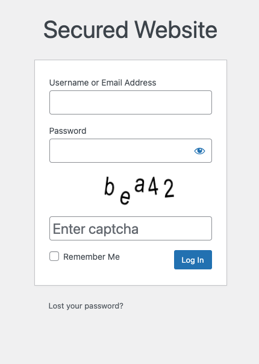

# WPS - Captcha

Very simplified captcha security added on Wordpress Login.
This will prevent basic brute force attacks on the form.
Is not bulletproof but will discard some bots.
Highly inspired from [wp-limit-login-attempts](https://wordpress.org/plugins/wp-limit-login-attempts/)



### Minimalist
- No admin message
- No buy plugin messages
- No setup

### Config
Can be disabled with an env `WPS_CAPTCHA_DISABLE=true`

### Dependencies
It has no dependencies other than Bedrock and Wordpress.

### Install

How to install with [Bedrock](https://roots.io/bedrock/) :

```bash
composer require zouloux/wps-captcha
```
